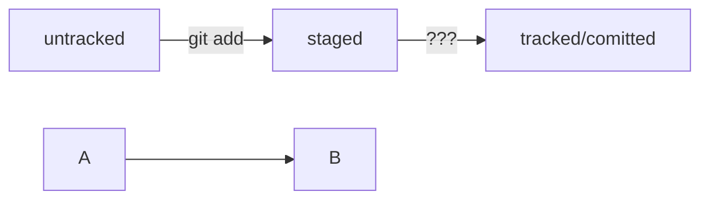

# Шпаргалка. Базовые команды в консоли
## Навигация
* pwd (от англ. print working directory, «показать рабочую папку») — покажи, в какой я папке;
* ls (от англ. list directory contents, «отобразить содержимое директории») — покажи файлы и папки в текущей папке;
* ls -a — покажи также скрытые файлы и папки, названия которых начинаются с символа .;
* cd first-project (от англ. change directory, «сменить директорию») — перейди в папку first-project;
* cd first-project/html — перейди в папку html, которая находится в папке first-project;
* cd .. — перейди на уровень выше, в родительскую папку;
* cd ~ — перейди в домашнюю директорию (/Users/Username);
* cd / — перейди в корневую директорию.

## Работа с файлами и папками
### Создание
* touch index.html (англ. touch, «коснуться») — создай файл index.html в текущей папке;
* touch index.html style.css script.js — если нужно создать сразу несколько файлов, можно напечатать их имена в одну строку через пробел;
  mkdir second-project (от англ. make directory, «создать директорию») — создай папку с именем second-project в текущей папке.
### Копирование и перемещение
* cp file.txt ~/my-dir (от англ. copy, «копировать») — скопируй файл в другое место;
* mv file.txt ~/my-dir (от англ. move, «переместить») — перемести файл или папку в другое место.
### Чтение
* cat file.txt (от англ. concatenate and print, «объединить и распечатать») — распечатай содержимое текстового файла file.txt.
### Удаление
* rm about.html (от англ. remove, «удалить») — удали файл about.html;
* rmdir images (от англ. remove directory, «удалить директорию») — удали папку images;
* rm -r second-project (от англ. remove, «удалить» + recursive, «рекурсивный») — удали папку second-project и всё, что она содержит.

## Полезные возможности

* Команды необязательно печатать и выполнять по очереди. Можно указать их списком — разделить двумя амперсандами (&&).
* У консоли есть собственная память — буфер с несколькими последними командами. По ним можно перемещаться с помощью клавиш со стрелками вверх (↑) и вниз (↓).
* Чтобы не вводить название файла или папки полностью, можно набрать первые символы имени и дважды нажать Tab. Если файл или папка есть в текущей директории, командная строка допишет путь сама.
  Например, вы находитесь в папке dev. Начните вводить cd first и дважды нажмите Tab. Если папка first-project есть внутри dev, командная строка автоматически подставит её имя. Останется только нажать Enter.

## Что такое хеш. Хеширование коммитов

Хеширование (от англ. hash, «рубить», «крошить», «мешанина») — это способ преобразовать набор данных и получить их «отпечаток» (англ. fingerprint).
Информация о коммите — это набор данных: когда был сделан коммит, содержимое файлов в репозитории на момент коммита и ссылка на предыдущий, или родительский (англ. parent), коммит.

Git хеширует (преобразует) информацию о коммите с помощью алгоритма SHA-1 (от англ. Secure Hash Algorithm — «безопасный алгоритм хеширования») и получает для каждого коммита свой уникальный хеш — результат хеширования.
Обычно хеш — это короткая (40 символов в случае SHA-1) строка, которая состоит из цифр 0—9 и латинских букв A—F (неважно, заглавных или строчных). 
Она обладает следующими важными свойствами:
* если хеш получить дважды для одного и того же набора входных данных, то результат будет гарантированно одинаковый;
* если хоть что-то в исходных данных поменяется (хотя бы один символ), то хеш тоже изменится (причём сильно).

HEAD -- это голова.
Коммит -- это всему голова.
Статусы файлов:
<тут пустая строка!>

<и тут пустая строка!>